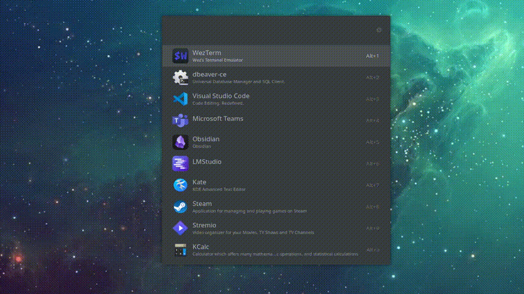
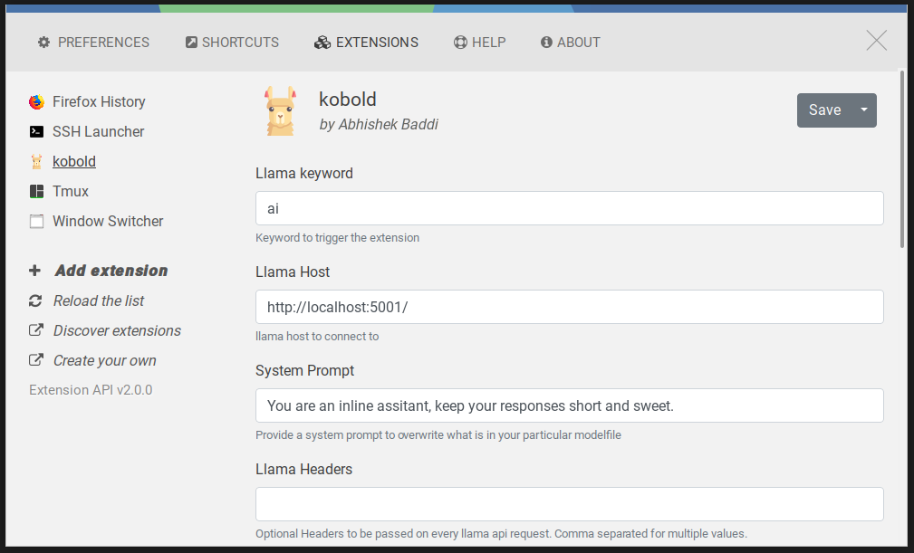

  

  

## Ulauncher Koboldcpp extension ##

This is an extension for [ULauncher](https://ulauncher.io/). That allows you to generate responses from your self hosted koboldcpp instance.

### Features
- View and interact with all models in your koboldcpp instances 

### Settings

  

